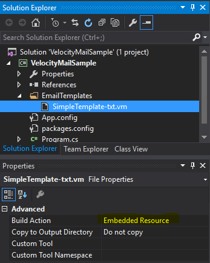

# VelocityMail

A simple, rich e-mail templating library for all .NET languages:
 * Minimal dependencies - only [Castle NVelocity](https://github.com/castleproject/MonoRail/tree/master/MR2/NVelocity)
 * Easy to learn Apache Velocity syntax for the templates. See [the official user guide](http://velocity.apache.org/engine/1.7/user-guide.html).
 * Localised templates with a fallback template for other languages.
 * Alternative views (HTML and TEXT bodies)
 * Attachments
 * E-mail address re-writing
 * Saving copies of sent e-mails to the file system.

## Getting Started

Open Visual Studio and create a new C# Console Application and then install the NuGet package.

```
Install-Package VelocityMail
```

### Creating an E-mail Template

Templates can be stored on disk, embedded in an assembly or both. We'll embed ours in this simple example.

Create a folder in your project called ```EmailTemplates``` and create a new text file, ```SimpleTemplate-txt.vm``` (the ```-txt.vm``` suffix tells VelocityMail that this is a simple plain text e-mail).

Enter this in the body of the file:

```
Hello $name,

This e-mail was sent from VelocityMail on $today.
```

**Important**: Set the _Build Action_ for in Visual Studio to _Embedded Resource_, otherwise the template will not be embedded in the assembly at build time:



### Construct the Service and Send the E-mail

Finally, we construct the service, telling VelocityMail where to find our templates and send the e-mail!

```csharp
using System;
using VelocityMail.Service;

namespace VelocityMailSample
{
    class Program
    {
        static void Main(string[] args)
        {
            // Create a new instance of the VelocityMailService and tell it our
            // templates are in the VelocityMailSample assembly in the
            // VelocityMailSample.EmailTemplates namespace.
            var mailService = new VelocityMailService(new VelocityMailOptions
            {
                TemplatesAssembly = "VelocityMailSample.EmailTemplates, VelocityMailSample",
                DefaultFrom = "me@foo.com"
            });

            using (var msg = mailService.CreateMailMessage("SimpleTemplate"))
            {
                msg.To.Add("you@bar.com");

                // Subject can have Velocity tags in it too
                msg.Subject = "VelocityMail sent this on $today.";

                msg.Put("name", "Jonathan");
                msg.Put("today", DateTime.Today.ToShortDateString());

                mailService.Send(msg);
            }
        }
    }
}
```

The body of the received e-mail will look something like this (depending on your mail reader):

```
MIME-Version: 1.0
From: me@foo.com
To: you@bar.com
Date: 17 Aug 2016 23:48:58 +0100
Subject: VelocityMail sent this on 17/08/2016.

Hello Jonathan,

This e-mail was sent from VelocityMail on 17/08/2016.
```

## Other Examples

See the [source](https://github.com/zxjon22/VelocityMail/tree/master/src) for more complete examples.

##Contributors

Please use the GitHub issues tracker to report any bugs or request enhancements. Pull requests welcome.

## License

MIT License - http://opensource.org/licenses/mit
